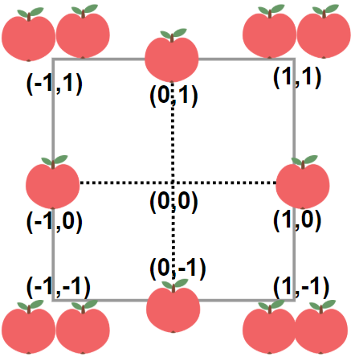

# 1954. [收集足够苹果的最小花园周长][_1954]

给你一个用无限二维网格表示的花园，每一个 整数坐标处都有一棵苹果树。整数坐标 `(i, j)` 处的苹果树有 `|i| + |j|` 个苹果。

你将会买下正中心坐标是 `(0, 0)` 的一块 正方形土地 ，且每条边都与两条坐标轴之一平行。

给你一个整数 `neededApples` ，请你返回土地的 最小周长 ，使得 至少 有 `neededApples` 个苹果在土地 里面或者边缘上。

`|x|` 的值定义为：

- 如果 `x >= 0` ，那么值为 `x`
- 如果 `x < 0` ，那么值为 `-x`

<p>&nbsp;</p>

<strong>示例 1：</strong>



<pre>
<strong>输入：</strong> neededApples = 1
<strong>输出：</strong> 8
<strong>解释：</strong> 边长长度为 1 的正方形不包含任何苹果。但是边长为 2 的正方形包含 12 个苹果（如上图所示）。周长为 2 * 4 = 8 。
</pre>

<strong>示例 2：</strong>

<pre>
<strong>输入：</strong> neededApples = 13
<strong>输出：</strong> 16
</pre>

<strong>示例 3：</strong>

<pre>
<strong>输入：</strong> neededApples = 1000000000
<strong>输出：</strong> 5040
</pre>

<p>&nbsp;</p>

<strong>提示：</strong>

- <code>1 &lt;= neededApples &lt;= 10<sup>5</sup></code>

<p>&nbsp;</p>

## 方法一：枚举

提示 1

如果正方形土地的右上角坐标为 $(n,n)$，即边长为 $2n$，周长为 $8n$，那么其中包含的苹果总数为：

$$
Sn ​= 2n(n + 1)(2n + 1)
$$

提示 1 解释

对于坐标为 $(x,y)$ 的树，它有 $|x| + |y|$ 个苹果。因此，一块右上角坐标为 $(n,n)$ 的正方形土地包含的苹果总数为

$$
Sn = \sum_{x=-n}^{n} \sum_{y=-n}^{n} |x|+|y|
$$

由于 $x$ 和 $y$ 是对称的，因此：

$$
\begin{aligned}
Sn
& = 2 \sum_{x=-n}^{n} \sum_{y=-n}^{n} |x| \\
& = 2 \sum_{x=-n}^{n} (2n + 1) |x| \\
& = 2(2n + 1) \sum_{x=-n}^{n} |x| \\
& = 2n(n + 1)(2n + 1)
\end{aligned}
$$

<strong>思路与算法</strong>

我们从小到大枚举 $n$，直到 $2n(n+1)(2n+1)≥neededApples$ 为止。

<strong>代码</strong>

```rust
use super::Solution;

impl Solution {
    pub fn minimum_perimeter(needed_apples: i64) -> i64 {
        let mut n = (needed_apples as f64 / 4.0).cbrt() as i64;
        if 2 * n * (n + 1) * (2 * n + 1) < needed_apples {
            n += 1;
        }
        8 * n
    }
}

#[cfg(test)]
mod tests {
    use crate::leet_code::Solution;

    #[test]
    fn test_minimum_perimeter() {
        assert_eq!(Solution::minimum_perimeter(1), 8);
        assert_eq!(Solution::minimum_perimeter(13), 16);
        assert_eq!(Solution::minimum_perimeter(1000000000), 5040);
    }
}
```

<strong>复杂度分析</strong>

- 时间复杂度：$O(m^{1/3})$，其中 $m$ 表示题目中的 $neededApples$。可以发现，$Sn$ 是关于 $n$ 的三次函数，因此需要枚举的 $n$ 的数量级为 $O(m^{1/3})$。

- 空间复杂度：$O(1)$ 。

<p>&nbsp;</p>

## 方法二：二分查找

<strong>思路与算法</strong>

由于 $Sn$ 是随着 $n$ 单调递增的，那么我们可以通过二分查找的方法，找出最小的满足 $Sn≥neededApples$ 的 $n$ 值即为答案。

<strong>细节</strong>

二分查找的下界可以直接置为 $1$，而上界 $right$ 需要保证有 $C_{right}^{}>=neededApples$。
根据方法一，我们只需要令 $right=⌊neededApples^{1/3}⌋$ 即可，其中 $⌊⋅⌋$ 表示向下取整。
但由于大部分语言中立方根运算较难实现，在实际的编码中，我们可以取一个更加宽松的上界，
例如 $neededApples^{1/3}$ 最大值 $10^{15}$ 的立方根 $10^5$。

<strong>代码</strong>

```rust

```

<strong>复杂度分析</strong>

- 时间复杂度：$O(log\ m)$，其中 $m$ 表示题目中的 $neededApples$。即为二分查找需要的时间。

- 空间复杂度：$O(1)$。

[_1954]: https://leetcode.cn/problems/minimum-garden-perimeter-to-collect-enough-apples/description/
