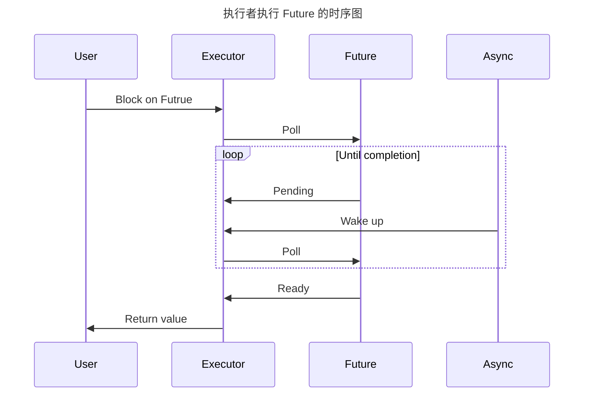
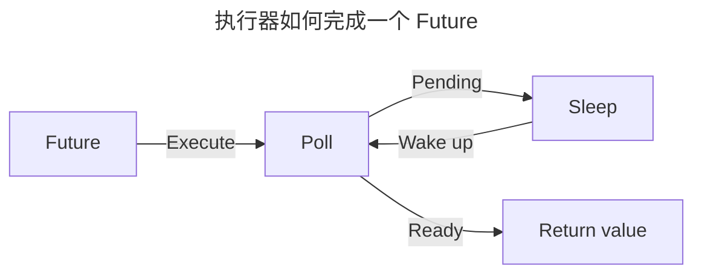

# Rust 异步工作原理

- 原文地址：<https://bertptrs.nl/2023/04/27/how-does-async-rust-work.html>

---

Rust 拥有一个日益发展的异步系统。如果你的应用程序大量使用 IO，那么你应该 “使用异步”，一切都会高效运行。
你可以有 `async fn`，`.await` 随时可以在后台处理，而 CPU 则做一些有用的工作。
然后你学习添加 [Tokio] 以便它能做些什么，而这一切可能看起来像是魔法。
幸运的是，计算机不是靠魔法运作的，因此我们可以尝试简化事情，以获得更好的理解。今天，我想就这么做。

非常快速的版本是，Rust 中的异步函数只是常规函数的语法糖，但不是直接返回值，而是给你一个实现 `Future` 特质的复杂状态机。

```rust
// The following function
async fn foo() -> i32 {
    // …
}

// Actually desugars to
fn foo() -> impl Future<Output = i32> {
    // …
}
```

然后，编译器生成适当的类型和实现。这很有帮助，但仍然过于复杂。
我将重点介绍我认为最重要的两个组件，即 [Future 特质](#future-特质)和[执行器](#执行器-executor)，
最后展示可用于运行异步代码的最小执行器实现。让我们先从特质开始。

## Future 特质

这个 [Future] 特质虽然是异步 Rust 工作的基础，但却是一个相当简单的特性。就是这么简单，这里是完整的：

```rust
pub trait Future {
    type Output;

    fn poll(self: Pin<&mut Self>, cx: &mut Context<'_>) -> Poll<Self::Output>;
}
```

`Output` 关联的类型表示将来最终将返回的类型，而 `poll` 方法将检查异步进程是否已完成，如果已完成，
则返回 `Poll::Ready(Self::Output)`，如果尚未完成，则返回 `Poll::Pending`
这里的 `Pin<&mut Self>` 存在有许多复杂的原因，本文中很大程度上忽略这些原因。

至关重要的是，一个 Future 本身不会做任何事情。它应该快速返回一个 `Poll::Pending` 或 `Poll::Ready`，
以便程序可以继续检查其他 Futures，或者回到睡眠状态。未来实际的工作应该在其他地方进行。

关于 `poll` 方法的唯一一个有趣的事情是它需要接收一个 `Context` 方法。截至撰写本文时，context
的唯一目的是提供一个 `Waker`(一个引用)，您可以稍后唤醒 Executor。我们接下来会讨论这个问题。

## Future 的示例

因此，异步函数被转换为 `impl Future` 类型，但最终必须是异步的。
为了说明这一点，让我们看一个简单的 future，它不返回任何内容，但生成一个线程，并在它生成的线程完成时完成。

```rust
use std::sync::Arc;
use std::sync::atomic::{AtomicBool, Ordering};

struct ThreadedFuture {
    started: bool,
    completed: Arc<AtomicBool>
};

impl std::future::Future for ThreadedFuture {
    type Output = ();

    fn poll(mut self: std::pin::Pin<&mut Self>, cx: &mut Context<'_>) -> Poll<Self::Output> {
        // 1. Check if the completion was already done
        if !self.completed.load(Ordering::Acquire) {
            if !self.started {
                // 2. If we have not completed and haven't started the thread, start a background thread.
                self.started = true;

                let completer = Arc::clone(&self.completed);
                let waker = cx.waker().clone();

                thread::spawn(move || {
                    // 3. First mark the future as completed
                    completer.store(true, Ordering::Release);
                    // 4. Then wake up the executor
                    waker.wake();
                });
            }

            // 5. Now we've set up the async completion but haven't finished yet, so return Pending.
            Poll::Pending
        } else {
            // 6. Already completed, so return.
            Poll::Ready(())
        }
    }
}
```

这里有一堆样板代码，但基本概念相对简单：

1. 检查我们是否已经完成了 future。如果没有，检查我们是否已经开始了异步计算
2. 如果没有，后台启动一个线程，最终完成计算
3. 在那个线程中，将我们自己标记为已完成
4. 唤醒
5. 然后返回一个「挂起 `Pending`」状态
6. 最后，如果我们证明已经完成了，返回「就绪 `Ready`」状态。

## 「执行器 `Executor`」

异步编程的另一个关键部分是执行器。执行器主要需要轮询 Futures 的状态，当没有任务要做时进入睡眠状态，
并提供一个合适的「唤醒器 `Waker`」以便在有任务时被唤醒。
许多实现(例如 `tokio`)提供了大量的额外功能，但本质上它需要完成的步骤如下：



当用户向执行器提供一个 `Future` 时，执行器将开始轮询它，直到它最终返回一个值。
这种轮询不是一个繁忙的循环；相反，执行器会等待，直到它收到一个唤醒信号。
[^1]这个信号可以来自任何线程，甚至是一个简单的 C 风格信号处理程序，通常会特定于底层异步过程。另外，以流程图形式表示：



对于执行器的实现来说，信号来自哪里并不重要。只要它能够引起唤醒，Future 就应该再次被轮询。
有了这个知识，我们可以构建一个基本的执行器。不过我们不必这么做；在标准库的文档中，
你可以找到一个[故意有点错误的执行器实现][exa][^2]它正是实现了这一点。

我可以写一个正确的示例执行器，就像我在 Future 做一个示例一样，但碰巧我已经这样做了，并将其作为 crate 发布。现在让我们来看看。

## 介绍 Beul

本文的主要原因是 [Beul] 1.0.0 版本的发布。Beul是一个基于上述思想的安全、简约的 Futures执行器。
它非常简约，只有84行（带注释的）代码，而且其整个公共 API 看起来如下：

```rust
pub fn execute<T>(f: impl Future<Output = T>) -> T
```

代码从这一点开始相对简单，如果你还在试图理解异步执行的概念，我建议你查看一下。
那么一个显而易见的问题是，人们为什么要使用这个，而不是一个功能齐全的异步框架呢？
主要原因是编写与执行器无关的异步代码的测试，以及在大体上是同步代码中使用异步库。

你可以嵌套调用 `beul::execute`，从你的异步代码中调用一些同步代码，而这些同步代码又使用 Beul 来调用异步代码。
在许多情况下，为了性能考虑，最好不要这样做，并且尽可能在可能的情况下 `.await` 任何异步函数调用。

### 现有技术

Beul 绝不是第一个最小的 futures 执行器。许多 crates 实现了相同的东西，并具有类似的想法。
我认为有必要提及我所知道的那些，以及为什么我认为 Beul 可能是一个更好的选择。

- [Pollster] 提供了与这个 crate 大致相同的实现，但有一个微小的不安全代码的使用，这在 Rust 1.68 之后可以移除。
  它使用了一个扩展特质来提供其阻塞功能。它最近也获得了一组（可选的）过程宏，允许你以某种方式注释异步 `main()` 或测试，
  以便它们可以正常执行。Beul 更加简约，并使用动态调度来减少代码大小。

- [futures-executor] 提供了几个执行器，使 futures 的使用更简单。它的 [block_on] 执行器类似于 Beul 的 API，
  尽管调用它不能有意地嵌套。它也是一个相当大的 crate。

- [extreme] 具有与 Beul 相同的API，但在 Wake 特质之前，因此其执行器实现必须使用不安全 Rust。
  `extreme` 还根据 GNU 公共许可证获得许可，这可能使它不适用于许多应用程序。尽管版本控制方案有些奇特，但还不错。

- [Yet Another Async Runtime]（或 `yaar`）和 [safina-executor] 都提供了更通用的执行器框架，
  而不仅仅是执行 futures 的东西。如果你需要更多功能，它们是有意义的，但对于简单的 future 执行，Beul 应该足够了。

如果这还不足以说服你，那么在这些中，Beul 和 extreme 是唯一达到或超过1.0.0的，
这应该会让 ZeroVer 社区中那些挑剔和讽刺的人们感到高兴。

### future

以标准库异步 Rust 的当前状态，我认为 Beul “已完成”。
它执行 futures，效率高，而且（截至目前）它的工作方式没有重大改进。

当然，这一切仍然可能发生变化。未来的 Rust 肯定会有一个更广泛的异步标准库，
我希望 Beul 能够支持它。现在，这就是全部。

## 总结

异步 Rust 包含执行器，这些执行器会不断地轮询 futures，直到它们完成。
当 future 仍然处于挂起状态时，执行器会去做其他事情，通常是休眠，然后再次轮询 future。如此循环，直到完成。

有了这个，我希望我已经为你提供了对幕后发生的事情的直观理解。
理想情况下，你永远不需要深入了解细节，但当抽象变得过于泄露时，现在你至少知道了。
另外，如果你能查看 Beul，我将非常感激。就是这样。

[Tokio]: https://tokio.rs/
[Future]: https://doc.rust-lang.org/std/future/trait.Future.html
[exa]: https://doc.rust-lang.org/std/task/trait.Wake.html#examples
[Beul]: https://docs.rs/beul/latest/beul/
[Pollster]: https://crates.io/crates/pollster
[futures-executor]: https://crates.io/crates/futures-executor
[block_on]: https://docs.rs/futures-executor/latest/futures_executor/fn.block_on.html
[extreme]: https://crates.io/crates/extreme
[Yet Another Async Runtime]: https://crates.io/crates/yaar
[safina-executor]: https://crates.io/crates/safina-executor

[^1]: 任何实现都可以是一个繁忙的循环，因为 future 在虚假轮询下应该表现得正常。当然，这并不是最佳的资源利用方式。
[^2]: 这个例子稍微有点过于简化，并且可能受到虚假唤醒（因为 `thread::park` 可能会这样做）和竞态条件（因为唤醒可能在轮询之后但在执行器挂起之前到来）的影响，所以它并不是立即有用的。
