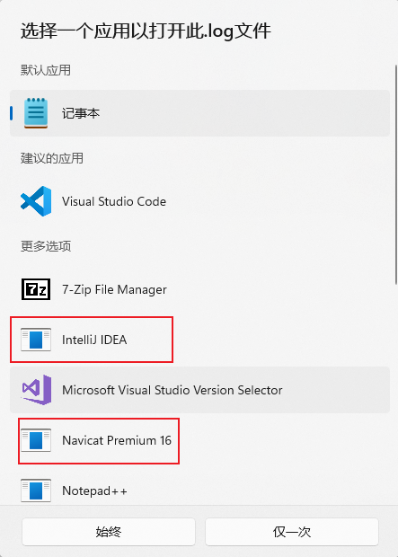
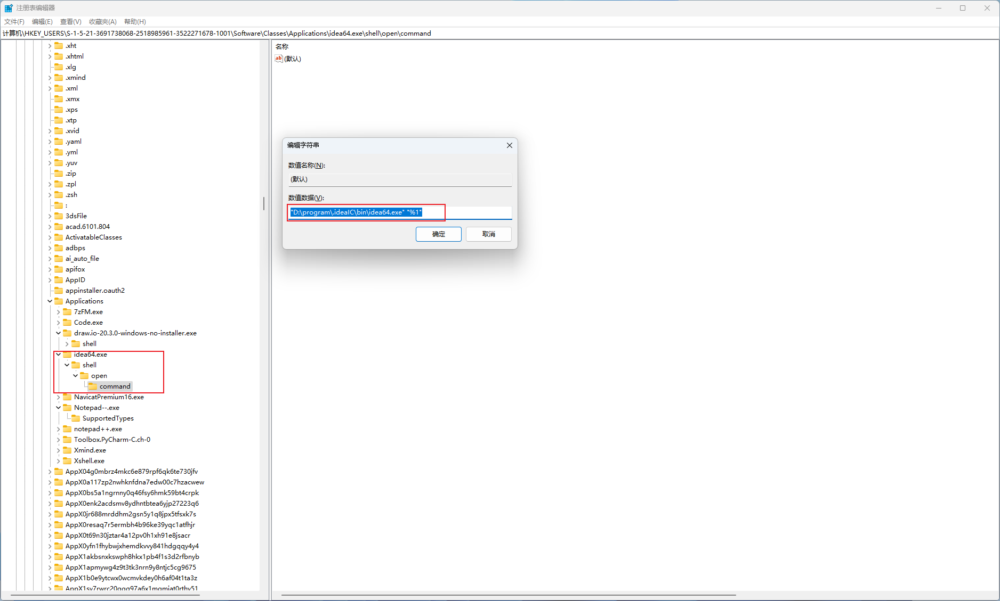
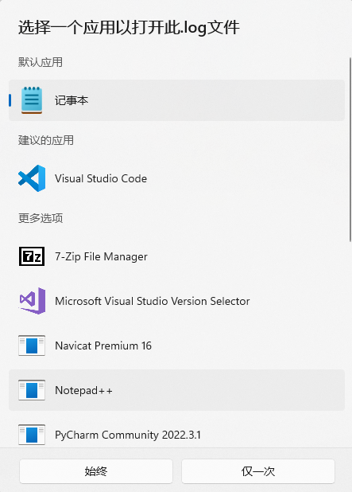

# Windows 设置

## Win11用微软拼音输入法，打出繁体中文字

<https://www.bilibili.com/video/BV1yS4y1i7C5/?vd_source=9bfc54d2ed901f1eab04708cc346c2f5>

<p>&nbsp;</p>

## Windows 常用指令

<kbd>win</kbd> + <kbd>+R</kbd>

```sh
# file : 文件所在的绝对路径
$ certutil -hashfile file MD5  # 查看文件md5

$ tree /f  # 查看文件树状结构
```

<p>&nbsp;</p>

## 如何在默认打开方式设置中去掉已失效\已删除的应用选项？



`win + r` --> Regedit

```sh
计算机\HKEY_USERS\S-1-5-21-3691738068-2518985961-3522271678-1001\Software\Classes\Applications
```



成功删除



<p>&nbsp;</p>

## Windows 修改指定用户密码

```sh
# net user 当前用户名 设置的密码
net user administrator 1qaz@WSX
```

参考文档

- [Windows 修改账户密码（不用u盘）【破解】](https://blog.csdn.net/qq_22841387/article/details/123024452)
